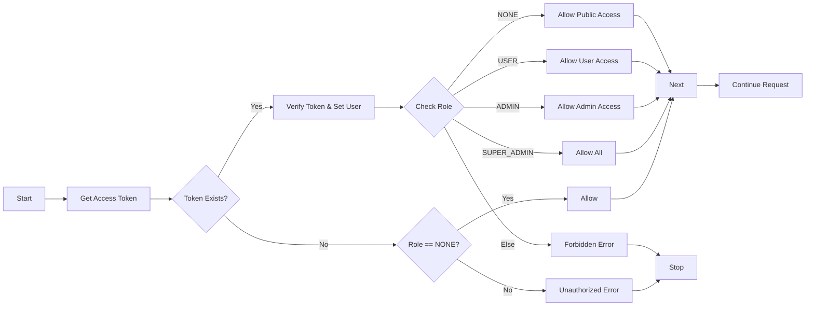
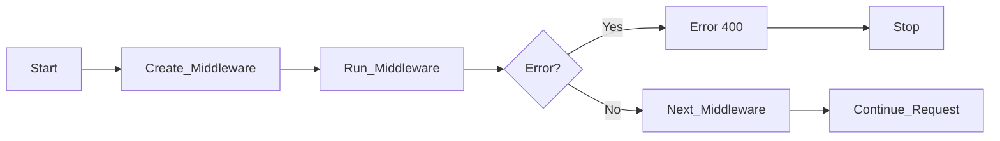

# Welive 프로젝트 개인 개발 보고서

**작성자**: 박규남  
**백엔드 저장소**: [https://github.com/nb02-welive-team3-org/nb02-welive-team3-org](https://github.com/nb02-welive-team3-org/nb02-welive-team3-org)

## 구현 기능 / 요소 목록

### API

1. [Auth API](#auth-api)
2. [Apartments API](#apartments-api)
3. [Users API](#users-api)
4. [Notification API](#notification-api)

### 미들웨어

1. [Role Middleware](#role-middleware)
2. [File Middleware](#file-middleware)

### 유틸리티

1. [Error Util](#error-util)
2. [File Util](#file-util)
3. [Password Util](#password-util)
4. [Token Util](#token-util)
5. [User Util](#user-util)
6. [From Util](#from-util)

## API

### Auth API

| HTTP Method | Endpoint                | Access Role | Description                      |
| ----------- | ----------------------- | ----------- | -------------------------------- |
| POST        | `/signup`               | NONE        | 일반 사용자 회원가입             |
| POST        | `/signup/admin`         | NONE        | 관리자(Admin) 회원가입           |
| POST        | `/signup/super-admin`   | NONE        | 슈퍼관리자(Super Admin) 회원가입 |
| POST        | `/login`                | NONE        | 로그인                           |
| POST        | `/logout`               | USER        | 로그아웃                         |
| POST        | `/refresh`              | USER        | 토큰 갱신 (리프레시 토큰)        |
| PATCH       | `/admins/:id/status`    | SUPER_ADMIN | 특정 관리자 계정 상태 변경       |
| PATCH       | `/admins/status`        | SUPER_ADMIN | 다수 관리자 계정 상태 일괄 변경  |
| PATCH       | `/residents/:id/status` | ADMIN       | 특정 거주자 계정 상태 변경       |
| PATCH       | `/residents/status`     | ADMIN       | 다수 거주자 계정 상태 일괄 변경  |
| PATCH       | `/admins/:id`           | SUPER_ADMIN | 관리자 정보 수정                 |
| DELETE      | `/admins/:id`           | SUPER_ADMIN | 관리자 계정 삭제                 |
| POST        | `/cleanup`              | ADMIN       | 데이터 정리 (청소) 작업 수행     |

### Apartments API

| HTTP Method | Endpoint | Access Role | Description           |
| ----------- | -------- | ----------- | --------------------- |
| GET         | `/`      | NONE        | 아파트 목록 조회      |
| GET         | `/:id`   | NONE        | 특정 아파트 상세 조회 |

### Users API

| HTTP Method | Endpoint | Access Role | Middleware                 | Description                     |
| ----------- | -------- | ----------- | -------------------------- | ------------------------------- |
| PATCH       | `/me`    | USER        | `singleFileUpload('file')` | 내 정보 수정 (비밀번호, 이미지) |

### Notification API

```typescript
import { Router } from 'express';
import { allow, AllowedRole } from '../middlewares/allow.middleware';
import { handleGetNotifications, handleReadNotification } from './notifications.controller';

const notifications = Router();

notifications.get('/sse', allow(AllowedRole.USER), handleGetNotifications);
notifications.patch('/:id/read', allow(AllowedRole.USER), handleReadNotification);

export default notifications;
```

## 미들웨어

### Role Middleware



```typescript
import { Request, Response, NextFunction } from 'express';
import { ForbiddenError, UnauthorizedError } from '../types/error.type';
import { isUser, isUserAdmin, isUserSuperAdmin, setUser } from '../utils/user.util';
import { getAccessToken, verifyAccessToken } from '../utils/token.util';

export enum AllowedRole {
  USER = 'USER',
  ADMIN = 'ADMIN',
  SUPER_ADMIN = 'SUPER_ADMIN',
  NONE = 'NONE',
}

export const allow = (role: AllowedRole) => {
  return async (req: Request, _res: Response, next: NextFunction) => {
    const accessToken = getAccessToken(req);

    if (accessToken === undefined) {
      if (role === 'NONE') {
        return next();
      }
      throw new UnauthorizedError();
    }

    const payload = verifyAccessToken(accessToken);

    setUser(req, payload);

    if (isUserSuperAdmin(payload)) return next();

    if (role === 'ADMIN' && isUserAdmin(payload)) return next();

    if (role === 'USER' && (isUser(payload) || isUserAdmin(payload))) return next();

    if (role === 'NONE' && (isUser(payload) || isUserAdmin(payload) || isUserSuperAdmin(payload))) return next();

    throw new ForbiddenError();
  };
};
```

### File Middleware



```typescript
import { Request, Response, NextFunction } from 'express';
import { upload } from '../utils/file.util';

export const singleFileUpload = (fieldName: string) => {
  const middleware = upload.single(fieldName);
  return (req: Request, res: Response, next: NextFunction) => {
    middleware(req, res, (err: any) => {
      if (err) {
        return res.status(400).json({ message: err.message });
      }
      next();
    });
  };
};
```

## 유틸리티

### Error Util

```typescript
import { MulterError } from 'multer';
import { HttpError } from '../types/error.type';
import { JsonWebTokenError } from 'jsonwebtoken';

export const isErrorInstanceOfHttp = (error: unknown): error is HttpError => error instanceof HttpError;
export const isErrorInstanceOfMulter = (error: unknown): error is MulterError => error instanceof MulterError;
export const isErrorInstanceOfJwt = (error: unknown): error is JsonWebTokenError => error instanceof JsonWebTokenError;
export const isErrorInstanceOfNode = (error: unknown): error is Error => error instanceof Error;
```

### File Util

```typescript
import multer from 'multer';
import path from 'path';
import { S3Client, PutObjectCommand } from '@aws-sdk/client-s3';
import { BadRequestError } from '../types/error.type';

export const upload = multer({
  storage: multer.memoryStorage(),
  limits: { fileSize: 10 * 1024 * 1024 },
});

export const uploadCsv = multer({
  storage: multer.memoryStorage(),
  limits: { fileSize: 10 * 1024 * 1024 },
  fileFilter: (_req, file, cb) => {
    const ext = path.extname(file.originalname).toLowerCase();
    const isCsv = file.mimetype === 'text/csv' || ext === '.csv';
    cb(null, isCsv);
  },
});

export const s3 = new S3Client({
  region: process.env.AWS_REGION!,
  credentials: {
    accessKeyId: process.env.AWS_ACCESS_KEY_ID!,
    secretAccessKey: process.env.AWS_SECRET_ACCESS_KEY!,
  },
});

export const uploadImage = async (file: Express.Multer.File, pathPrefix: string, id: string) => {
  if (!file) {
    throw new BadRequestError('파일이 존재하지 않습니다.');
  }

  const key = `${pathPrefix}/${id}/${Date.now()}-${file.originalname}`;

  await s3.send(
    new PutObjectCommand({
      Bucket: process.env.AWS_S3_BUCKET!,
      Key: key,
      Body: file.buffer,
      ContentType: file.mimetype,
    })
  );

  return `https://${process.env.AWS_S3_BUCKET!}.s3.${process.env.AWS_REGION!}.amazonaws.com/${key}`;
};
```

### Password Util

```typescript
import bcrypt from 'bcrypt';

const SALT_OR_ROUND = 10;

export const hashPassword = async (password: string): Promise<string> => await bcrypt.hash(password, SALT_OR_ROUND);

export const comparePassword = async (raw: string, hashed: string): Promise<Boolean> =>
  await bcrypt.compare(raw, hashed);
```

### Token Util

```typescript
import { Request, Response } from 'express';
import jwt from 'jsonwebtoken';
import { Payload } from '../types/payload.type';
import { InternalServerError } from '../types/error.type';
import env from '../config/env';

// ACCESS_TOKEN 생성
export const generateAccessToken = (payload: Payload): string => {
  const expiresIn = env.JWT_ACCESS_EXPIRATION;
  return jwt.sign(payload, env.JWT_ACCESS_SECRET, { expiresIn });
};

// REFRESH_TOKEN 생성
export const generateRefreshToken = (payload: Payload): string => {
  const expiresIn = env.JWT_REFRESH_EXPIRATION;
  return jwt.sign(payload, env.JWT_REFRESH_SECRET, { expiresIn });
};

// ACCESS_TOKEN 검증
export const verifyAccessToken = (token: string): Payload => {
  return jwt.verify(token, env.JWT_ACCESS_SECRET) as Payload;
};

// REFRESH_TOKEN 검증
export const verifyRefreshToken = (token: string): Payload => {
  return jwt.verify(token, env.JWT_REFRESH_SECRET) as Payload;
};

// [!] 배포 시 secure: true로 변경 필요(https에서만 쿠키 전송)
export const setAccessToken = (res: Response, token: string) => {
  res.cookie('access_token', token, {
    httpOnly: true,
    secure: false,
    sameSite: 'strict',
    maxAge: env.JWT_ACCESS_EXPIRATION,
  });
};

export const getAccessToken = (req: Request): string | undefined => {
  return req.cookies?.['access_token'];
};

export const deleteAccessToken = (res: Response) => {
  res.clearCookie('access_token');
};

// [!] 배포 시 secure: true로 변경 필요(https에서만 쿠키 전송)
export const setRefreshToken = (res: Response, token: string) => {
  res.cookie('refresh_token', token, {
    httpOnly: true,
    secure: false,
    sameSite: 'strict',
    maxAge: env.JWT_REFRESH_EXPIRATION,
  });
};

export const getRefreshToken = (req: Request): string | undefined => {
  return req.cookies?.['refresh_token'];
};

export const deleteRefreshToken = (res: Response) => {
  res.clearCookie('refresh_token');
};

// 남은 토큰 기간 확인
export const getTokenRemainSeconds = (token: string): number => {
  const decoded = jwt.decode(token) as jwt.JwtPayload | null;
  if (!decoded) {
    throw new InternalServerError('invalid token: decode failed');
  }

  const { exp } = decoded;
  if (typeof exp !== 'number') {
    throw new InternalServerError('invalid token: missing exp');
  }

  const nowInSeconds = Math.floor(Date.now() / 1000);
  return exp - nowInSeconds;
};
```

### User Util

```typescript
import { Request } from 'express';
import { Payload } from '../types/payload.type';
import { UnauthorizedError } from '../types/error.type';
import { UserRole } from '../entities/user.entity';

export const getUser = (req: Request): Payload => {
  const user = req.user;
  if (user !== undefined) {
    return user;
  }
  throw new UnauthorizedError();
};
export const setUser = (req: Request, user: Payload): Payload => (req.user = user);
export const isUser = (user: Payload): boolean => user.role === UserRole.USER;
export const isUserAdmin = (user: Payload): boolean => user.role === UserRole.ADMIN;
export const isUserSuperAdmin = (user: Payload): boolean => user.role === UserRole.SUPER_ADMIN;
```

### From Util

```typescript
import { Request } from 'express';

export const getIp = (req: Request): string => req.ip || 'unknown';
export const getUrl = (req: Request): string => req.url || 'unknown';
export const getMethod = (req: Request): string => req.method || 'unknown';
```
